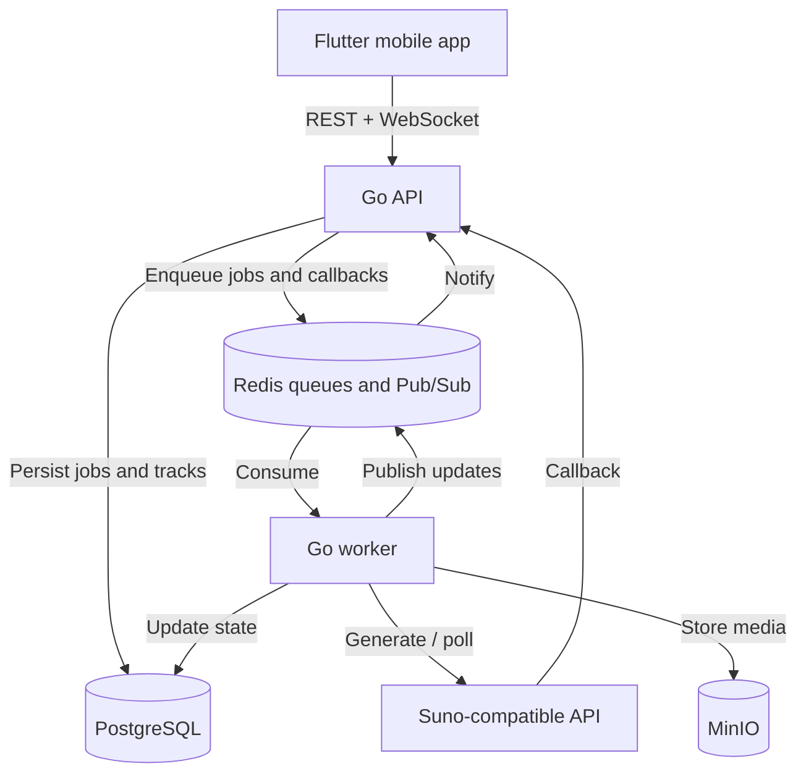

# AI Music Generator

<p align="center">
  <strong>A full-stack mobile application for asynchronous AI music generation.</strong>
</p>

<p align="center">
  
  
  
  
  
</p>

AI Music Generator turns a text prompt or custom lyrics into generated music. The Flutter client submits a generation request, while the Go backend persists the job, processes it asynchronously through Redis, integrates with a Suno-compatible API, stores generated media in MinIO, and sends real-time status updates over WebSockets.

> This project integrates with an external music-generation provider. It does not train or host its own ML model.

## Highlights

- Text-to-music and custom lyrics generation
- Asynchronous job processing with retries and dead-letter queues
- Real-time generation updates over WebSockets
- Persistent jobs and track metadata in PostgreSQL
- S3-compatible audio and cover storage with MinIO
- Callback processing with polling fallback
- Track library, playback, favorites, deletion, and downloads
- Anonymous device-based MVP sessions
- Docker Compose environment with Nginx and Swagger UI
- Layered Go backend with domain, application, ports, and adapters

## Architecture



### Generation flow

1. The Flutter app creates a job through `POST /jobs`.
2. The API validates the request, creates an anonymous user when necessary, persists the job, and publishes it to Redis.
3. The worker consumes the job and starts generation through the external provider.
4. Completion is detected through a callback or polling fallback.
5. Generated audio and optional cover artwork are downloaded into MinIO.
6. Track metadata and the final job state are stored in PostgreSQL.
7. Redis Pub/Sub triggers a WebSocket update for the requesting client.
8. The app opens the generated track in the player.

## Technology stack

| Area | Technologies |
|---|---|
| Mobile client | Flutter, Dart, Riverpod, GoRouter, Dio, Audioplayers |
| Backend | Go 1.24, `net/http`, Gorilla WebSocket |
| Database | PostgreSQL 16, SQL migrations, Squirrel, sqlx |
| Messaging | Redis Lists, processing queues, retries, DLQ, Pub/Sub |
| Object storage | MinIO / S3-compatible storage |
| AI integration | Suno-compatible generation API, callbacks, polling |
| Infrastructure | Docker Compose, Nginx, Swagger UI |
| Testing | Go unit and handler tests, Flutter widget tests |

## Repository structure

```text
.
├── apps/
│   └── mobile_flutter/        # Flutter application
├── services/
│   ├── cmd/
│   │   ├── api/               # HTTP and WebSocket server
│   │   └── worker/            # Background consumers
│   ├── internal/
│   │   ├── domain/            # Entities and business rules
│   │   ├── httpapi/           # HTTP handlers and DTOs
│   │   ├── ports/             # Application interfaces
│   │   ├── queue/             # Redis queue adapters
│   │   ├── realtime/          # WebSocket hub and subscriber
│   │   ├── repo/postgres/     # PostgreSQL repositories
│   │   ├── service/           # Application services
│   │   ├── storage/           # MinIO adapter
│   │   ├── suno/              # Generation API client
│   │   └── worker/            # Job and callback processors
│   └── migrations/            # PostgreSQL migrations
├── docs/                      # OpenAPI and architecture documentation
├── infra/                     # Docker Compose and Dockerfiles
├── nginx/                     # Reverse proxy configuration
└── scripts/                   # Smoke checks
```

## Getting started

### Prerequisites

- Docker and Docker Compose
- Flutter SDK for running the mobile client
- A provider API key for real music generation

### 1. Configure the environment

```bash
cp .env.example .env
```

The main variables are:

| Variable | Purpose |
|---|---|
| `POSTGRES_DSN` | PostgreSQL connection string |
| `REDIS_ADDR` | Redis server address |
| `S3_ENDPOINT` | Internal MinIO/S3 endpoint |
| `S3_PUBLIC_ENDPOINT` | Endpoint accessible to the client |
| `S3_ACCESS_KEY` / `S3_SECRET_KEY` | Object-storage credentials |
| `SUNO_MODE` | `dev` or provider-backed mode |
| `SUNO_API_KEY` | External generation API key |
| `SUNO_CALLBACK_URL` | Public callback URL or local fallback URL |
| `SUNO_POLL_FALLBACK` | Enables polling when callbacks are unavailable |
| `SUNO_CALLBACK_SECRET` | Protects the callback endpoint |

Never commit the local `.env` file.

### 2. Start the backend

From the repository root:

```bash
docker compose -f infra/docker-compose.yml up --build
```

The database migrations run automatically.

| Service | Local address |
|---|---|
| API | `http://localhost:8080` |
| Nginx | `http://localhost:8088` |
| Swagger UI | `http://localhost:8081` |
| MinIO API | `http://localhost:9000` |
| MinIO Console | `http://localhost:9001` |

Check the service:

```bash
curl http://localhost:8080/health
curl http://localhost:8080/ready
```

### 3. Run the Flutter application

```bash
cd apps/mobile_flutter
flutter pub get
flutter run
```

The current local defaults target an Android emulator. For a physical device or another platform, configure API, WebSocket, and public object-storage hosts that are reachable from that device.

## API overview

Every user-facing request uses an anonymous installation identifier:

```http
X-Device-Id: <uuid>
```

| Method | Endpoint | Description |
|---|---|---|
| `GET` | `/health` | Liveness check |
| `GET` | `/ready` | PostgreSQL and Redis readiness |
| `POST` | `/jobs` | Create a generation job |
| `GET` | `/jobs` | List the current user's jobs |
| `GET` | `/jobs/{id}` | Get a job and its generated tracks |
| `GET` | `/tracks` | List generated tracks |
| `GET` | `/tracks/{id}` | Get track metadata |
| `DELETE` | `/tracks/{id}` | Delete a track |
| `PUT` | `/tracks/{id}/favorite` | Add a track to favorites |
| `DELETE` | `/tracks/{id}/favorite` | Remove a track from favorites |
| `GET` | `/tracks/{id}/download` | Get a temporary download URL |
| `GET` | `/ws` | Subscribe to real-time updates |
| `POST` | `/suno/callback` | Receive provider callbacks |

The complete contract is available in [`docs/openapi1.yml`](docs/openapi1.yml).

### Example request

```bash
curl -X POST http://localhost:8080/jobs \
  -H "Content-Type: application/json" \
  -H "X-Device-Id: 11111111-1111-1111-1111-111111111111" \
  -d '{
    "prompt": "Atmospheric electronic track for a night drive",
    "instrumental": true,
    "model": "V4_5ALL"
  }'
```

## Testing

### Go

```bash
cd services
gofmt -w .
go test ./...
go vet ./...
```

### Flutter

```bash
cd apps/mobile_flutter
dart format .
flutter analyze
flutter test
```

### Smoke checks

With the Docker environment running:

```bash
bash scripts/smoke_api.sh
```

## Current status

The repository contains an end-to-end MVP: mobile request creation, asynchronous generation, persistent jobs, media ingestion, real-time updates, and track playback.

Current limitations:

- Playlists are stored locally and are not synchronized with the backend.
- Local networking defaults are optimized for an Android emulator.
- Anonymous `X-Device-Id` sessions are suitable for an MVP, not strong authentication.
- Real generation depends on the configured third-party provider.

## Roadmap

- Persistent playlists
- Configurable mobile environments
- Account authentication and cross-device libraries
- Recovery of in-flight polling after worker restarts
- Additional integration and end-to-end tests
- CI/CD pipelines
- Production deployment configuration

## Contributors

This project was built collaboratively. See the full list of [contributors](https://github.com/Alexandr-prog34/Ai-Music-App/graphs/contributors).
